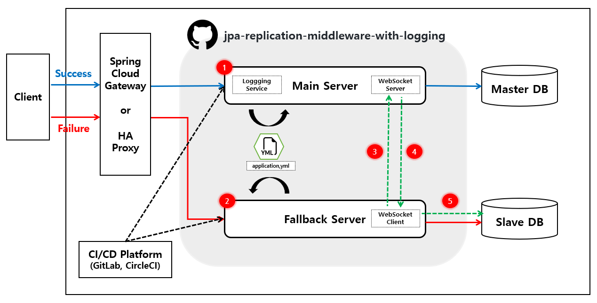

# jpa-replication-middleware-with-logging
Active-Standby를 위한 DB 이중화 근본 기술 개발

## Init Setting
- [Spring Initilaizr](https://start.spring.io/#!type=gradle-project&language=java&platformVersion=2.7.8&packaging=jar&jvmVersion=1.8&groupId=com.opensw&artifactId=master&name=master&description=DB%20Auto%20Backup%20for%20Spring%20Boot&packageName=com.opensw.master&dependencies=websocket,data-jpa,mariadb,lombok,devtools,validation)

## Compatible
- JAVA: OpenJDK 1.8.0_282
- DB: 10.4.11-MariaDB

## System Infra Concept (PoC)


## Background & Purpose
- When there is a failure in the main server, the application service itself supports duplication of data without a backup service that supports DB redundancy, and it aims to provide a service that replicates data in a cycle of 1 second and supports the fallback function.
- Utilizing the logback function supported by the spring boot app itself, preparing a plan to check the failure point in real time by executing logging every 0.1 second.
- DB dualization method: Currently, only primary key replication configuration is allowed

## Quick Start
1. git clone https://github.com/er3busNote/jpa-replication-middleware-with-logging.git
2. edit application.yml: `/master/src/main/resources/application.yml`
   For simplicity, I also added run_docker.sh file for an even easier setting-up and running this solution. 
```
spring:
  config:
    activate:
      on-profile: master or slave
  datasource:
    username: root
    password: root
    url: jdbc:mariadb://${server.host.mariadb}:3309/replica_master		# -> Setting the DB port
    driver-class-name: org.mariadb.jdbc.Driver
  jpa:
    properties:
      hibernate:
        hbm2ddl:
          #auto: create		# -> To automatically run database migrations on startup
          auto: validate
```
3. create build file: `build.bat`
4. start application file: `start-master.bat` & `start-slave.bat`
	- For simplicity, I also added {start-master,start-slave,build}.bat file for an even easier setting-up and running this application. 

## Contact us
- qudwn0768@naver.com